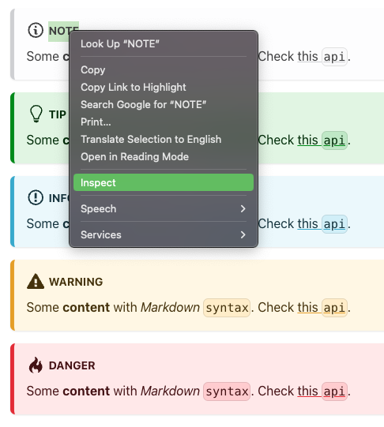
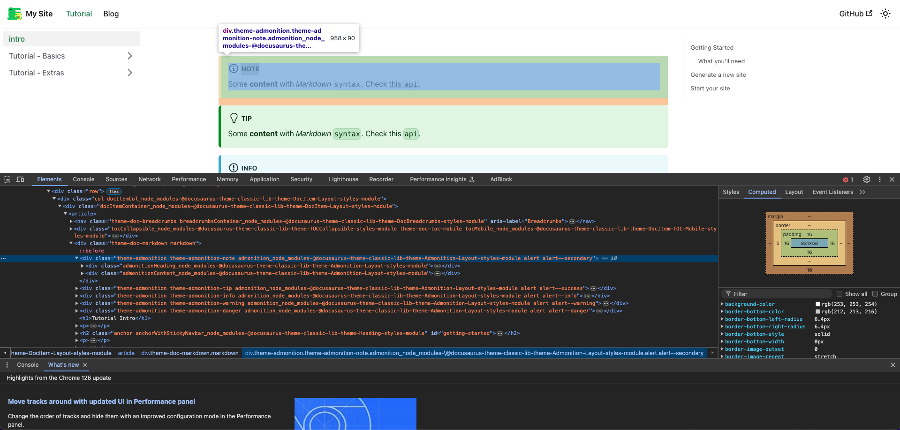
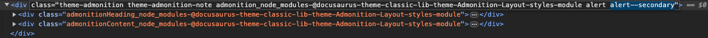
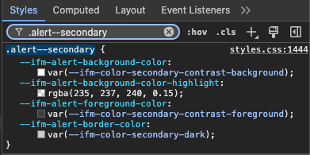
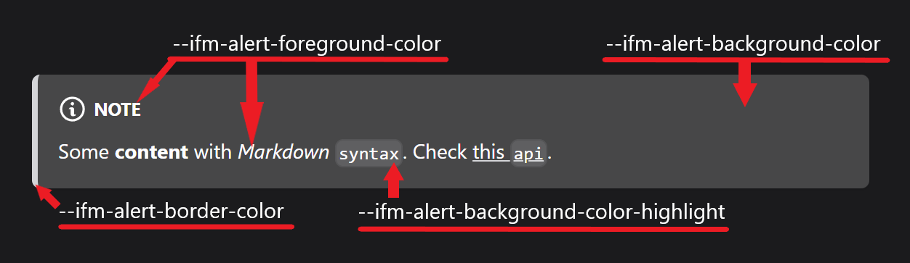
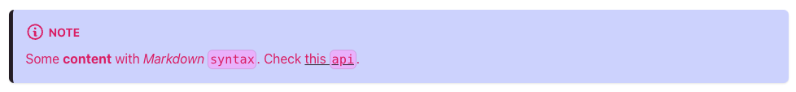
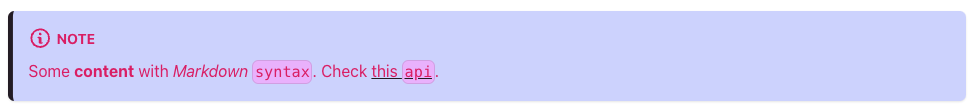
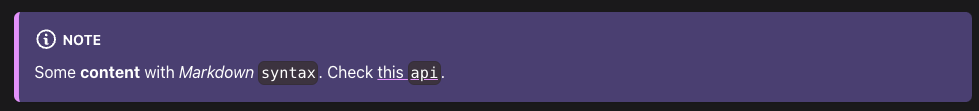

:::success[Beginner Friendly]

This guide is made for beginners, by beginners, aiming to explain how Docusaurus uses HTML
and CSS to create page elements. No prior front-end knowledge is needed!

:::

When working on your Docusaurus project, you may not like the appearance of the default
admonitions... If you are looking to override their color WITHOUT creating a whole new
admonition, then you've come to the right place!

:::info

This page does not cover how to create custom admonitions, only overriding the default
Docusaurus admonition appearance. If you want to create custom admonitions that DON'T interfere with the default
admonitions, we have a guide for that: [Admonitions](/knowledge/component-library/existing/Admonitions/)

:::

## Background Knowledge

If you are unfamiliar with the Docusaurus admonitions and their appearance, visit the Docusaurus
official documentation relating to admonitions by clicking the button below.

<DocusaurusButton
  label="Docusaurus Documentation: Admonitions"
  to="https://docusaurus.io/docs/markdown-features/admonitions"
/>

To understand how admonitions work, we need to utilize Inspect Element to find things such
as HTML class names and CSS values that the admonitions use.

### Using Inspect Element

The best way to see how admonitions work (if you are using Chrome) is to highlight the title
of the admonition, right-click, and select "Inspect." This will bring up Inspect Element.
Inspect is key to figuring out how to override the appearance of the default admonitions.

:::tip

If you want to make changes to any element of your website but find yourself stuck, Inspect
Element is a powerful tool for making local, temporary changes!

:::



From here, we can find the HTML of all the Docusaurus page elements. For this guide, we are only
going to focus on the admonitions.

## Analyzing the HTML (Using Inspect)

When clicking inspect on your site, you may find something like this:



Don't be afraid! This is the HTML that Docusaurus generates to make your website!
If you click around in Inspect Element, you will eventually find the elements that
are the admonitions. We can see that the "note" admonition that we highlighted is
an HTML `<div>` element, with a couple of classes attatched to it.



For our purposes, we are interested in that last class: `alert--secondary`. This is
the driving class that tells the "note" admonition what colors to use. We can find what
variables it uses with Inspect Element as well. Switch to the "Styles" tab in Inspect Element
and use the search bar to find the "note" admonition's class: `alert--secondary`.

## Analyzing the CSS (Using Inspect)



This is the note admonitions CSS code. This is what tells the note admonition what
colors to use. We see four attributes and their corresponding default variables:

### ⭐️ Note admonition's default CSS Values

| CSS Attribute                            | Default Value                                    |
| ---------------------------------------- | ------------------------------------------------ |
| `--ifm-alert-background-color`           | `var(--ifm-color-secondary-contrast-background)` |
| `--ifm-alert-background-color-highlight` | `rgba(235, 237, 240, 0.15)`                      |
| `--ifm-alert-foreground-color`           | `var(--ifm-color-secondary-contrast-foreground)` |
| `--ifm-alert-border-color`               | `var(--ifm-color-secondary-dark)`                |



Let's say we want to override the background of the "note" admonition to purple. Well,
we can change the value using Inspect and see the color update in real time. Try changing
the value of `--ifm-alert-background-color` to any color!

:::warning

All changes made using Inspect Element are temporary! Refreshing the page will revert any changes
we made with Inspect.

:::


## Updating the CSS

Now that we know that the CSS is responsible for the appearance of admonitions, we need to
update the CSS code of our Docusaurus site to override the default values to our new colors.

In your code editor, in the directory of your Docusaurus site, navigate to `src/css/custom.css`.
This is where we can add permanent overrides to the CSS of our site, which means we can update the
colors of our admonitions.

We want to make overrides to the `alert--secondary` (note admonition) class's CSS we found. Add the
`alert--secondary` class to your `custom.css` by copy and pasting the code below into `custom.css`.

```css title="src/css/custom.css"
.alert--secondary {
  --ifm-alert-background-color: rgb(237, 219, 255);
  --ifm-alert-background-color-highlight: rgb(235, 237, 240);
  --ifm-alert-foreground-color: var(--ifm-color-secondary-contrast-foreground);
  --ifm-alert-border-color: var(--ifm-color-secondary-dark);
}
```

Now, we can change the variables here to any color we desire! This next code block will override the
"note" admonition's color to an example of colors.

```css title="src/css/custom.css"
.alert--secondary {
  --ifm-alert-background-color: rgb(210, 216, 255);
  --ifm-alert-background-color-highlight: rgb(233, 187, 255);
  --ifm-alert-foreground-color: rgb(216, 36, 111);
  --ifm-alert-border-color: rgb(38, 31, 41);
}
```



:::tip

You can also define colors using hex values!

```css title="src/css/custom.css"
.alert--secondary {
  --ifm-alert-background-color: #d2d8ff;
  --ifm-alert-background-color-highlight: #e9bbff;
  --ifm-alert-foreground-color: #d8246f;
  --ifm-alert-border-color: #261f29;
}
```

:::

## ⭐️ Admonition Class Names

Here are the names of all the default admonition classes:

| Admonition | Class Name         |
| ---------- | ------------------ |
| Note       | `alert--secondary` |
| Tip        | `alert--success`   |
| Info       | `alert--info`      |
| Warning    | `alert--warning`   |
| Danger     | `alert--danger`    |

You can use these class names in `custom.css` to override their appearance as well, just
like how we did with the "note" admonition.

## Making Color-Responsive Admonitions

You may notice that your new colors might not look good when your Docusaurus site switches
from light mode to dark mode (or vice versa). In order to make our admonitions responsive
to the color mode of our website, we can use custom CSS variables!

### Make a Custom CSS Variable

First, let's make a custom CSS variable that will store any color of our choice.

In your `custom.css`, Docusaurus comes with a `:root` and a `[data-theme='dark']` config by
default. You can name your variable anything you would like, just make sure it is descriptive
and fits your needs!

:::note

It is recommended you add a new config: `[data-theme='light']`, although, it is not
required, and all light mode variables can be put inside of `:root`. The guide will continue with
creating the new config for the light theme.

:::

```css css title="src/css/custom.css"
[data-theme='light'] {
  --note-bg: rgb(210, 216, 255);
}
```

### Apply Custom CSS Variable

Now that we created our new color variable `--note-bg`, we have to apply it to the `alert--secondary`
CSS class. Update the static RGB value of `.alert--secondary` to our new variable, using `var()`.

```css title="src/css/custom.css"
.alert--secondary {
  // highlight-next-line
  --ifm-alert-background-color: var(--note-bg);
  --ifm-alert-background-color-highlight: rgb(233, 187, 255);
  --ifm-alert-foreground-color: rgb(216, 36, 111);
  --ifm-alert-border-color: rgb(38, 31, 41);
}
```

Now, let's add a color for when the page is in dark mode. The procedure is very similar to the
previous steps, excpt we are adding a new variable to the dark mode config!

```css css title="src/css/custom.css"
[data-theme='light'] {
  --note-bg: rgb(210, 216, 255);
}

[data-theme='dark'] {
  --note-bg: rgb(83, 73, 126);
  // ...
}
```

Let's go ahead and set the colors of all our other parts of the note admonition. Here's an
example:

```css title="src/css/custom.css"
[data-theme='light'] {
  --note-bg: rgb(210, 216, 255);
  --note-highlight: rgb(233, 187, 255);
  --note-foreground: rgb(216, 36, 111);
  --note-border: rgb(38, 31, 41);
}

[data-theme='dark'] {
  --note-bg: rgb(83, 73, 126);
  --note-highlight: rgb(68, 58, 72);
  --note-foreground: rgb(255, 255, 255);
  --note-border: rgb(226, 158, 255);
  // ...
}

.alert--secondary {
  --ifm-alert-background-color: var(--note-bg);
  --ifm-alert-background-color-highlight: var(--note-highlight);
  --ifm-alert-foreground-color: var(--note-foreground);
  --ifm-alert-border-color: var(--note-border);
}
```

### Results

Now we can observe that the colors of our "note" admonition change between light mode and dark
mode!





## Conclusion

Congratulations! You are now a pro at overriding the basic colors of the "note" admonition!
Using your knowledge, you should be able to override the colors of all the default admonitions using
the [class names](#%EF%B8%8F-admonition-class-names) listed above!

:::tip

Use your new HTML and CSS knowledge to see what other elements of the webpage you can edit! Find
their class names, and tinker with them in your `custom.css` file, just like how you did with the
"note" admonition!

:::
